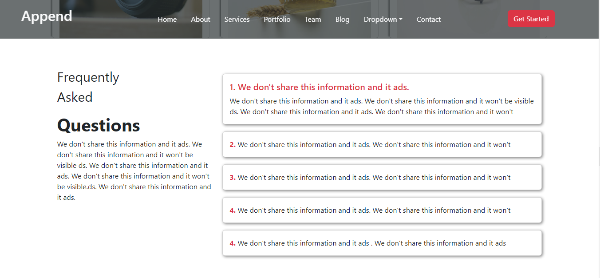

 
<h1>Frontend Website</h1>
 <b>"Append is a dynamic and visually appealing frontend website crafted using cutting-edge technologies – HTML5, CSS3, and JavaScript. 
   With seamless navigation and stunning design, this website offers a delightful user experience. Users can explore interactive interfaces,
   responsive layouts, and captivating animations, all built with HTML5's and Bootstrap structural elements, CSS3's styling prowess, and JavaScript's interactivity features.
   The website showcases a seamless fusion of creativity and functionality, ensuring an engaging experience across devices. From intuitive user interfaces to eye-catching visuals,
   Append demonstrates the power of modern frontend development, creating an immersive and user-friendly web environment."
</b> 

# That's all 🎊🎉 

## ScreenShots
   
   
   
   
   
   
   
   
   
   
   
   
